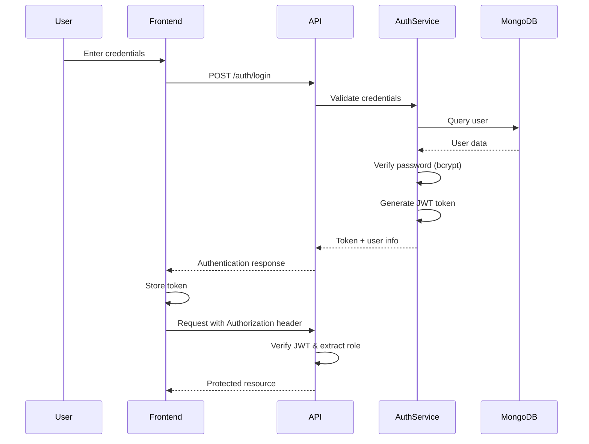

## Overview

Tesis Rutas is built using **Clean Architecture** principles, ensuring separation of concerns, testability, and maintainability. The system consists of a FastAPI backend, React frontend, and cloud services for data storage and media management.

<Note>
Clean Architecture organizes code into distinct layers with clear dependencies flowing from outer (infrastructure) to inner (domain) layers.
</Note>

## Architecture Diagram

```
┌─────────────────────────────────────────────────────────────┐
│                        Presentation Layer                    │
│  ┌────────────────────────────────────────────────────────┐ │
│  │   React Frontend (Vite + React Router + Leaflet)       │ │
│  │   - Interactive Maps (Leaflet, react-leaflet)          │ │
│  │   - UI Components (Radix UI, Tailwind CSS)             │ │
│  │   - State Management (Context API)                     │ │
│  │   - Forms (react-hook-form)                            │ │
│  └────────────────────────────────────────────────────────┘ │
└─────────────────────────────────────────────────────────────┘
                              ↕ HTTP/REST + JWT
┌─────────────────────────────────────────────────────────────┐
│                    Infrastructure Layer                      │
│  ┌────────────────────────────────────────────────────────┐ │
│  │   FastAPI REST API                                     │ │
│  │   - Routers (destinos, rutas, auth, usuarios)          │ │
│  │   - JWT Authentication & Role-Based Access             │ │
│  │   - CORS Middleware                                    │ │
│  │   - File Upload Handling                               │ │
│  └────────────────────────────────────────────────────────┘ │
│  ┌────────────────────────────────────────────────────────┐ │
│  │   External Services                                    │ │
│  │   - MongoDB Repository Implementations                 │ │
│  │   - Cloudinary Media Storage                           │ │
│  │   - JWT Token Service                                  │ │
│  └────────────────────────────────────────────────────────┘ │
└─────────────────────────────────────────────────────────────┘
                              ↕
┌─────────────────────────────────────────────────────────────┐
│                     Application Layer                        │
│  ┌────────────────────────────────────────────────────────┐ │
│  │   Use Cases (Business Logic Orchestration)             │ │
│  │   - AgregarDestinoUseCase                              │ │
│  │   - EditarDestinoUseCase                               │ │
│  │   - CrearRutaTuristicaUseCase                          │ │
│  │   - RegisterUsuarioUseCase                             │ │
│  │   - LoginUsuarioUseCase                                │ │
│  │   - AgregarMultimediaDestinoUseCase                    │ │
│  └────────────────────────────────────────────────────────┘ │
└─────────────────────────────────────────────────────────────┘
                              ↕
┌─────────────────────────────────────────────────────────────┐
│                       Domain Layer                           │
│  ┌────────────────────────────────────────────────────────┐ │
│  │   Entities (Pure Business Objects)                     │ │
│  │   - Destino                                            │ │
│  │   - RutaTuristica                                      │ │
│  │   - RutaPOI                                            │ │
│  │   - Usuario                                            │ │
│  │   - Multimedia                                         │ │
│  └────────────────────────────────────────────────────────┘ │
│  ┌────────────────────────────────────────────────────────┐ │
│  │   Value Objects                                        │ │
│  │   - Coordenadas (latitude, longitude)                  │ │
│  └────────────────────────────────────────────────────────┘ │
│  ┌────────────────────────────────────────────────────────┐ │
│  │   Repository Interfaces                                │ │
│  │   - IDestinoRepository                                 │ │
│  │   - IRutaRepository                                    │ │
│  │   - IUsuarioRepository                                 │ │
│  └────────────────────────────────────────────────────────┘ │
└─────────────────────────────────────────────────────────────┘
                              ↕
┌─────────────────────────────────────────────────────────────┐
│                      Data Storage Layer                      │
│  ┌────────────────────────────────────────────────────────┐ │
│  │   MongoDB Atlas (Database)                             │ │
│  │   - destinos collection                                │ │
│  │   - rutas collection                                   │ │
│  │   - usuarios collection                                │ │
│  └────────────────────────────────────────────────────────┘ │
│  ┌────────────────────────────────────────────────────────┐ │
│  │   Cloudinary (Media Storage)                           │ │
│  │   - destinations/{id}/ folders                         │ │
│  │   - Image & video hosting                              │ │
│  └────────────────────────────────────────────────────────┘ │
└─────────────────────────────────────────────────────────────┘
```

## Technology Stack

### Backend

<CardGroup cols={2}>
  <Card title="FastAPI" icon="bolt">
    Modern Python web framework with automatic API documentation, async support, and type validation
    
    **Version**: 0.121.1
  </Card>
  
  <Card title="Pydantic" icon="shield-check">
    Data validation using Python type annotations
    
    **Version**: 2.12.4
  </Card>
  
  <Card title="PyMongo" icon="database">
    Official MongoDB driver for Python
    
    **Version**: 4.15.3
  </Card>
  
  <Card title="python-jose" icon="key">
    JWT token creation and validation
    
    **Version**: 3.5.0
  </Card>
</CardGroup>

Key backend dependencies from `requirements.txt`:

```txt
fastapi==0.121.1
uvicorn==0.38.0
pymongo==4.15.3
pydantic==2.12.4
pydantic-settings==2.11.0
python-jose==3.5.0
bcrypt==5.0.0
cloudinary==1.44.1
python-dotenv==1.2.1
python-multipart==0.0.20
```

### Frontend

<CardGroup cols={2}>
  <Card title="React 19" icon="react">
    Modern UI library with latest features
    
    **Version**: 19.2.0
  </Card>
  
  <Card title="Vite" icon="zap">
    Lightning-fast build tool and dev server
    
    **Version**: 7.2.4
  </Card>
  
  <Card title="React Router" icon="route">
    Client-side routing with protected routes
    
    **Version**: 7.10.1
  </Card>
  
  <Card title="Leaflet" icon="map">
    Interactive map visualization
    
    **Version**: 1.9.4
  </Card>
</CardGroup>

Key frontend dependencies from `frontend/package.json`:

```json
{
  "dependencies": {
    "react": "^19.2.0",
    "react-dom": "^19.2.0",
    "react-router-dom": "^7.10.1",
    "leaflet": "^1.9.4",
    "react-leaflet": "^5.0.0",
    "axios": "^1.13.2",
    "react-hook-form": "^7.70.0",
    "@radix-ui/react-dialog": "^1.1.15",
    "@radix-ui/react-select": "^2.2.6",
    "tailwindcss": "^4.1.18",
    "@turf/turf": "^7.3.2"
  }
}
```

### Cloud Services

<Tabs>
  <Tab title="MongoDB Atlas">
    **Purpose**: Primary database for storing destinations, routes, and user data
    
    **Collections**:
    - `destinos` - Heritage destination documents
    - `rutas` - Tourist route documents
    - `usuarios` - User accounts and authentication
    
    **Connection**: Managed through `MongoDBConnection` singleton class (`src/infrastructure/database/mongo_config.py`)
    
    ```python
    class MongoDBConnection:
        _client = None
        _db = None
        
        @classmethod
        def connect(cls):
            cls._client = MongoClient(settings.mongo_uri, 
                                     serverSelectionTimeoutMS=5000)
            cls._db = cls._client[settings.mongo_db]
    ```
  </Tab>
  
  <Tab title="Cloudinary">
    **Purpose**: Media storage for destination images and videos
    
    **Features**:
    - Auto-detection of resource types (image/video)
    - Folder organization by destination ID
    - Metadata extraction (dimensions, duration, file size)
    - Optimized delivery URLs
    
    **Storage Pattern**: `destinations/{destino_id}/`
    
    Implementation in `src/infrastructure/api/routers/destinos_router.py:136-143`:
    ```python
    async def upload_async(file: UploadFile):
        file_bytes = await file.read()
        return await asyncio.to_thread(
            cloudinary.uploader.upload,
            file_bytes,
            folder=f"destinations/{id}",
            resource_type="auto"
        )
    ```
  </Tab>
</Tabs>

## Clean Architecture Layers

### 1. Domain Layer (Core Business Logic)

The innermost layer containing pure business objects with no external dependencies.

**Location**: `src/domain/`

<Tabs>
  <Tab title="Entities">
    Business objects representing core concepts.
    
    **Destino Entity** (`src/domain/entities/destino.py`):
    ```python
    class Destino:
        def __init__(
            self,
            nombre: str,
            ubicacion: str,
            importancia: str,
            coordenadas: Coordenadas,
            anio_construccion: list[int],
            arquitecto: Optional[str] = None,
            area_construccion: Optional[float] = None,
            funcion: Optional[str] = None,
            multimedia: Optional[list[dict]] = None,
            id: Optional[str] = None,
            fecha_creacion: Optional[datetime] = None,
            activo: bool = True
        ):
            self.nombre = nombre.strip()
            self.ubicacion = ubicacion.strip()
            self.importancia = importancia.strip()
            
            if not anio_construccion or len(anio_construccion) not in (1, 2):
                raise ValueError("El año de construcción debe contener uno o dos valores válidos.")
            
            self.anio_construccion = anio_construccion
            self.coordenadas = coordenadas
            # ... additional fields
    ```
    
    **RutaTuristica Entity** (`src/domain/entities/ruta_turistica.py`):
    ```python
    @dataclass
    class RutaTuristica:
        nombre: str
        descripcion: Optional[str]
        categoria: str
        puntos: List[RutaPOI] = field(default_factory=list)
        creado_en: datetime = field(default_factory=datetime.utcnow)
    ```
  </Tab>
  
  <Tab title="Value Objects">
    Immutable objects representing domain concepts.
    
    **Coordenadas** (`src/domain/value_objects/coordenadas.py`):
    ```python
    class Coordenadas:
        def __init__(self, latitud: float, longitud: float):
            self.latitud = latitud
            self.longitud = longitud
        
        def to_dict(self) -> dict:
            return {
                "latitud": self.latitud,
                "longitud": self.longitud
            }
    ```
  </Tab>
  
  <Tab title="Repository Interfaces">
    Abstract contracts defining data access operations.
    
    **Location**: `src/domain/repositories/`
    
    These interfaces define what operations are available without specifying how they're implemented, maintaining the separation of concerns.
  </Tab>
</Tabs>

### 2. Application Layer (Use Cases)

Orchestrates business logic by coordinating entities and repository operations.

**Location**: `src/application/use_cases/`

<Accordion title="Example: AgregarDestinoUseCase">
  From `src/application/use_cases/agregar_destino.py`:
  
  ```python
  class AgregarDestinoUseCase:
      def __init__(self, repository: IDestinoRepository):
          self.repository = repository
  
      def ejecutar(self, data: dict) -> str:
          coordenadas = Coordenadas(
              latitud=data["coordenadas"]["latitud"],
              longitud=data["coordenadas"]["longitud"]
          )
  
          destino = Destino(
              nombre=data["nombre"],
              ubicacion=data["ubicacion"],
              importancia=data["importancia"],
              coordenadas=coordenadas,
              anio_construccion=data["anio_construccion"],
              arquitecto=data.get("arquitecto"),
              area_construccion=data.get("area_construccion"),
              funcion=data.get("funcion")
          )
  
          return self.repository.crear_destino(destino)
  ```
  
  **Key Features**:
  - Depends on repository interface, not implementation
  - Validates and transforms input data
  - Creates domain entities
  - Returns simple types (IDs, success indicators)
</Accordion>

**Available Use Cases**:

<CardGroup cols={2}>
  <Card title="Destinations" icon="map-pin">
    - `AgregarDestinoUseCase`
    - `EditarDestinoUseCase`
    - `EliminarDestinoUseCase`
    - `CambiarEstadoDestinoUseCase`
    - `AgregarMultimediaDestinoUseCase`
    - `EliminarMultimediaDestinoUseCase`
  </Card>
  
  <Card title="Routes" icon="route">
    - `CrearRutaTuristicaUseCase`
    - `ActualizarRutaTuristicaUseCase`
    - `EliminarRutaTuristicaUseCase`
    - `ListarRutasTuristicasUseCase`
    - `ObtenerRutaTuristicaUseCase`
    - `GenerarRutaDesdePOIUseCase`
    - `SugerirPoisProximosUseCase`
  </Card>
  
  <Card title="Authentication" icon="shield">
    - `RegisterUsuarioUseCase`
    - `LoginUsuarioUseCase`
    - `AuthUseCases`
  </Card>
  
  <Card title="Users" icon="users">
    - `ActualizarUsuarioUseCase`
    - `AgregarFavoritoUseCase`
    - `AsignarRolAdminOnlyUseCase`
  </Card>
</CardGroup>

### 3. Infrastructure Layer

Implements technical details like API routes, database access, and external service integration.

**Location**: `src/infrastructure/`

<Tabs>
  <Tab title="API Layer">
    FastAPI routers handling HTTP requests.
    
    **Main Application** (`src/infrastructure/api/main.py`):
    ```python
    app = FastAPI(title="Turismo Digital UCE API")
    
    # CORS Configuration
    origins = [
        "http://localhost:5173",
        "http://127.0.0.1:5173",
        "https://tesis-rutas.vercel.app",
    ]
    
    app.add_middleware(
        CORSMiddleware,
        allow_origins=origins,
        allow_credentials=True,
        allow_methods=["*"],
        allow_headers=["*"],
    )
    
    # Include routers
    app.include_router(destinos_router.router)
    app.include_router(rutas_router.router)
    app.include_router(auth_router.router)
    app.include_router(usuario_router.router)
    ```
    
    **Routers**:
    - `destinos_router.py` - Destination CRUD operations
    - `rutas_router.py` - Route management
    - `auth_router.py` - Authentication endpoints
    - `usuario_router.py` - User management
  </Tab>
  
  <Tab title="Database">
    MongoDB repository implementations.
    
    **Connection Management** (`src/infrastructure/database/mongo_config.py`):
    ```python
    class MongoDBConnection:
        _client = None  # Singleton pattern
        _db = None
        
        @classmethod
        def connect(cls):
            if cls._client is None:
                print("🔗 Conectando a MongoDB Atlas...")
                cls._client = MongoClient(
                    settings.mongo_uri, 
                    serverSelectionTimeoutMS=5000
                )
                cls._db = cls._client[settings.mongo_db]
                cls._client.admin.command('ping')
                print(f"✅ Conectado a MongoDB ({settings.mongo_db})")
            return cls._db
    ```
    
    **Repository Implementations**:
    - `DestinoRepositoryImpl`
    - `RutaRepositoryImpl`
    - `UsuarioRepositoryImpl`
  </Tab>
  
  <Tab title="Security">
    JWT authentication and role-based access control.
    
    **JWT Utilities** (`src/infrastructure/security/jwt_utils.py`):
    - `require_user` - Any authenticated user
    - `require_editor` - Editor or admin role
    - `require_admin` - Admin role only
    
    **Auth Service** (`src/infrastructure/security/auth_service.py`):
    - Password hashing with bcrypt
    - JWT token generation and validation
    - Token expiration handling (60 minutes default)
  </Tab>
  
  <Tab title="Services">
    External service configurations.
    
    **Cloudinary Config** (`src/infrastructure/services/cloudinary_config.py`):
    - Cloud storage initialization
    - Upload configuration
    - Resource type detection
  </Tab>
</Tabs>

### 4. Presentation Layer (Frontend)

React application providing user interface.

**Location**: `frontend/src/`

<Accordion title="Routing Structure">
  From `frontend/src/router/AppRouter/AppRouter.jsx`:
  
  ```jsx
  <Routes>
    <Route element={<MainLayout />}>
      {/* Public Routes */}
      <Route path="/" element={<Home />} />
      <Route path="/login" element={<Login />} />
      <Route path="/register" element={<Register />} />
      <Route path="/destinos" element={<DestinosList />} />
      <Route path="/destinos/:id" element={<DestinoDetalle />} />
      <Route path="/rutas" element={<Rutas />} />
      <Route path="/rutas/:id" element={<RutaDetalle />} />
      <Route path="/mapa" element={<MapaPage />} />
      
      {/* Protected Routes - Editor/Admin */}
      <Route
        path="/admin/destinos/crear"
        element={
          <ProtectedRoute allowedRoles={["editor", "administrador"]}>
            <CrearDestino />
          </ProtectedRoute>
        }
      />
      
      {/* Protected Routes - Admin Only */}
      <Route
        path="/admin/usuarios"
        element={
          <ProtectedRoute allowedRoles={["administrador"]}>
            <UsuariosAdmin />
          </ProtectedRoute>
        }
      />
    </Route>
  </Routes>
  ```
</Accordion>

**Key Frontend Components**:

<CardGroup cols={2}>
  <Card title="Map Components" icon="map">
    - `MapView` - Main map container
    - `MapaBase` - Leaflet base configuration
    - `MapaPOI` - Point of Interest markers
    - `MapaSidebar` - Map controls and filters
  </Card>
  
  <Card title="UI Components" icon="palette">
    - Radix UI primitives (Dialog, Select, etc.)
    - Custom Card, Button, Input components
    - Form components with react-hook-form
    - Tailwind CSS styling
  </Card>
  
  <Card title="Context Providers" icon="database">
    - `AuthContext` - User authentication state
    - `DestinosContext` - Destinations data management
  </Card>
  
  <Card title="Hooks" icon="link">
    - `useAuth` - Authentication operations
    - `useRutas` - Routes data fetching
    - `useMapaDestinos` - Map data transformation
    - `useDestinosContext` - Destination CRUD
  </Card>
</CardGroup>

## Configuration Management

Settings are managed through environment variables and configuration files.

**Settings Class** (`src/config/settings.py`):

```python
class Settings(BaseSettings):
    app_name: str = "FARM Turismo API"
    debug: bool = True
    
    # MongoDB
    mongo_uri: str = None
    mongo_db: str = "turismo_digital_uce"
    
    # Cloudinary
    cloudinary_cloud_name: str | None = None
    cloudinary_api_key: str | None = None
    cloudinary_api_secret: str | None = None
    
    # JWT
    jwt_secret_key: str | None = None
    jwt_algorithm: str = "HS256"
    jwt_expire_minutes: int = 60
    
    class Config:
        env_file = ".env"
        env_file_encoding = "utf-8"
```

<Note>
Configuration can be loaded from environment variables, `.env` file, or `local_config.json` for local development.
</Note>

## Security Architecture

### Authentication Flow



### Role-Based Access Control

<Tabs>
  <Tab title="Visitor">
    **Permissions**:
    - View all public destinations
    - Browse tourist routes
    - View interactive maps
    - Register account
    
    **Restrictions**:
    - Cannot create or modify content
    - Cannot access admin features
  </Tab>
  
  <Tab title="Editor">
    **Permissions**:
    - All visitor permissions
    - Create destinations
    - Edit destinations
    - Create tourist routes
    - Edit tourist routes
    - Upload multimedia
    - Change destination status
    
    **Restrictions**:
    - Cannot manage users
    - Cannot assign roles
  </Tab>
  
  <Tab title="Administrator">
    **Permissions**:
    - All editor permissions
    - Delete destinations (physical deletion)
    - Manage users
    - Assign roles to users
    - Full system access
    
    **Implementation** (`src/infrastructure/security/jwt_utils.py`):
    ```python
    def require_admin(token: str = Depends(oauth2_scheme)):
        payload = verify_token(token)
        if payload.get("rol") != "administrador":
            raise HTTPException(
                status_code=403,
                detail="Acceso denegado. Se requiere rol de administrador."
            )
        return payload
    ```
  </Tab>
</Tabs>

## Data Flow Example

Here's how a complete operation flows through the architecture layers:

<Steps>
  <Step title="User Creates Destination">
    Admin user fills out the create destination form in the React frontend.
  </Step>
  
  <Step title="Frontend Validation">
    React Hook Form validates required fields before submission.
  </Step>
  
  <Step title="API Request">
    Frontend sends POST request to `/destinos/` with JWT token in Authorization header.
  </Step>
  
  <Step title="Authentication Middleware">
    FastAPI dependency `require_admin` verifies JWT and checks admin role.
  </Step>
  
  <Step title="Router Handler">
    `destinos_router.py` receives the request and extracts data.
  </Step>
  
  <Step title="Use Case Execution">
    `AgregarDestinoUseCase` is instantiated with repository implementation.
  </Step>
  
  <Step title="Entity Creation">
    Domain entity `Destino` is created with validation logic.
  </Step>
  
  <Step title="Repository Operation">
    `DestinoRepositoryImpl` saves the document to MongoDB.
  </Step>
  
  <Step title="Response">
    Success response with new destination ID flows back to frontend.
  </Step>
  
  <Step title="UI Update">
    Frontend redirects to destinations list showing the new entry.
  </Step>
</Steps>

## Benefits of This Architecture

<CardGroup cols={2}>
  <Card title="Testability" icon="flask">
    Each layer can be tested independently with mock dependencies
  </Card>
  
  <Card title="Maintainability" icon="wrench">
    Clear separation of concerns makes code easier to understand and modify
  </Card>
  
  <Card title="Flexibility" icon="shuffle">
    Easy to swap implementations (e.g., change database from MongoDB to PostgreSQL)
  </Card>
  
  <Card title="Scalability" icon="chart-line">
    Layers can be scaled independently based on performance needs
  </Card>
  
  <Card title="Domain Focus" icon="bullseye">
    Business logic remains pure and independent of frameworks
  </Card>
  
  <Card title="Type Safety" icon="shield-check">
    Pydantic models and TypeScript provide compile-time validation
  </Card>
</CardGroup>

## Next Steps

<CardGroup cols={2}>
  <Card title="Development Guide" icon="code" href="/guides/backend-setup">
    Set up your local environment and start contributing
  </Card>
  
  <Card title="API Reference" icon="book" href="/api/auth/register">
    Explore all available endpoints and data models
  </Card>
  
  <Card title="Frontend Components" icon="react" href="/guides/frontend-setup">
    Learn about React components and state management
  </Card>
  
  <Card title="Deployment" icon="rocket" href="/guides/deployment">
    Deploy the application to production
  </Card>
</CardGroup>
